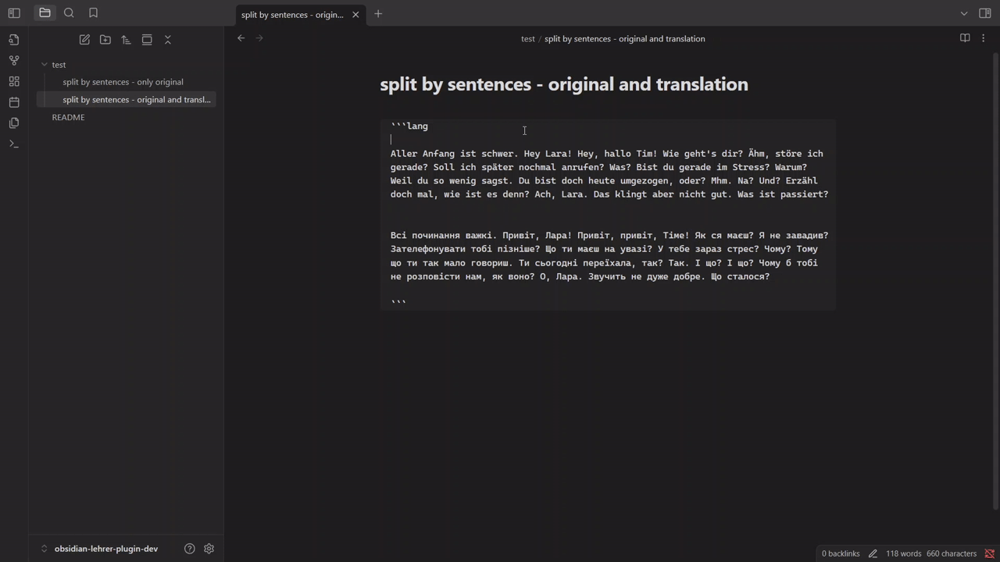
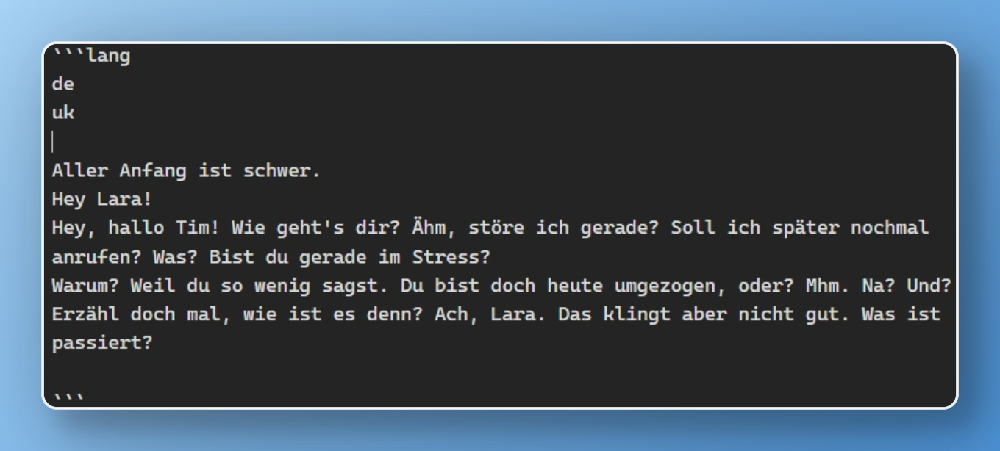
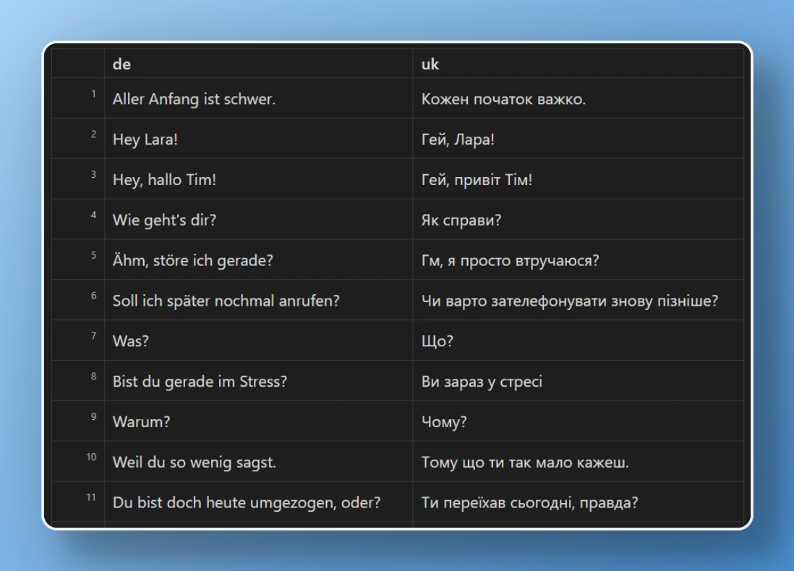
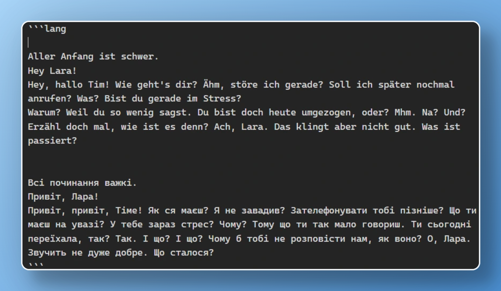
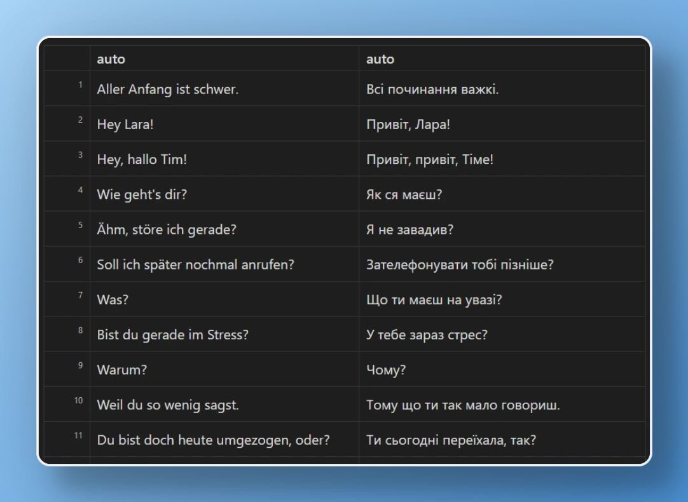

# Obsidian Lehrer Plugin

A plugin for [Obsidian](https://obsidian.md) that helps you learn German by providing seamless translation and language learning features directly in your notes.



## Features

-   Automatic translation of German text using Google Translate
-   Support for multiple target languages (ISO 639-1 codes)
-   Sentence-by-sentence translation for better learning context
-   Clean and simple interface integrated into code blocks

## Screenshots

### Translate from source to target language



is render to 🔽



### Separate by Sentences and Collate



is render to 🔽



## Usage

To use the plugin, create a code block with the `lang` language identifier. The plugin supports several formats:

### 1. Simple Translation

For quick translation of text, simply write your German text in a code block:

```lang
Hallo, wie geht es dir?
```

The plugin will automatically detect German and translate it to English.

### 2. Specify Target Language

To translate to a specific language, specify the ISO 639-1 language code first:

```lang
uk

Hallo, wie geht es dir?
```

This will translate the text to Ukrainian.

See [Alpha-2 codes](https://en.wikipedia.org/wiki/List_of_ISO_639-1_codes) for a full list of supported languages.

### 3. Specify Source and Target Languages

For explicit language pairs, specify both source and target languages:

```lang
de
uk

Hallo, wie geht es dir?
```

This will translate from German (de) to Ukrainian (uk).

## Installation

1. Open Obsidian Settings
2. Navigate to Community Plugins and disable Safe Mode
3. Click Browse and search for "Lehrer"
4. Install the plugin
5. Enable the plugin in your Community Plugins list

## Manual Installation

1. Download the latest release from the Releases section
2. Extract the files to your `.obsidian/plugins/obsidian-lehrer-plugin/` folder
3. Reload Obsidian
4. Enable the plugin in your Community Plugins list

## Requirements

-   Obsidian v0.15.0 or higher
-   Internet connection for translation features

## Privacy Notice

This plugin uses Google Translate API for translations. Please be aware that:

-   Text you translate is sent to Google's servers
-   Standard Google Translate privacy policy applies
-   No personal data is collected or stored by the plugin itself

## Development

### Prerequisites

-   Node.js 16+
-   pnpm (recommended) or npm
-   Git

### Setting up the development environment

1. Clone this repository

```sh
git clone https://github.com/yourusername/obsidian-lehrer-plugin.git
cd obsidian-lehrer-plugin
```

2. Install dependencies

```sh
pnpm i
```

3. Build the plugin

```sh
pnpm build
```

4. For development with hot-reload:

```sh
pnpm dev
```

### Testing

Run the test suite:

```bash
pnpm test
```

## Contributing

Contributions are welcome! Here's how you can help:

1. Fork the repository
2. Create a new branch for your feature
3. Make your changes
4. Submit a pull request

Please ensure your PR:

-   Follows the existing code style
-   Includes appropriate tests
-   Updates documentation as needed
-   Describes the changes in the PR description

## Support

If you encounter any issues or have suggestions, please:

1. Check the [GitHub Issues](https://github.com/yourusername/obsidian-lehrer-plugin/issues) page

2. Create a new issue if your problem isn't already listed

## Credits

-   Created by [Andrii Syrokomskyi](https://syrokomskyi.com).
-   Uses [Google Translate](https://translate.google.com/) for translations.

## Changelog

See [CHANGELOG.md](CHANGELOG.md) for a list of changes.

## License

This project is licensed under the MIT License - see the [LICENSE](LICENSE) file for details.
