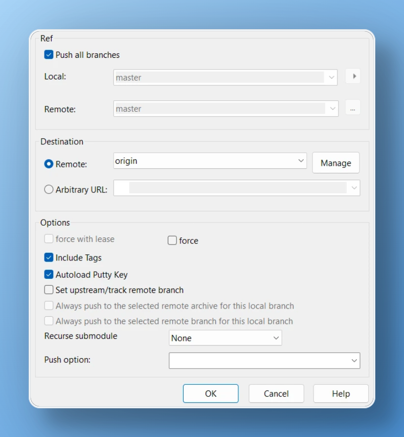

# Obsidian Lehrer Plugin

A plugin for [Obsidian](https://obsidian.md) that helps you learn German by providing seamless translation and language learning features directly in your notes.


## Features

-   Automatic translation of German text using Google Translate
-   Support for multiple target languages (ISO 639-1 codes)
-   Sentence-by-sentence translation for better learning context
-   Clean and simple interface integrated into code blocks

## Screenshots

### Translate from source to target language


will render 🔽


### Separate by Sentences and Collate


will render 🔽


## Usage

To use the plugin, create a code block with the `lang` language identifier. The plugin supports several formats:

### Simple Translation

For quick translation of text, simply write your German text in a code block:

```lang
Hallo, wie geht es dir?
```

The plugin will automatically detect German and translate it to English.

### Specify Target Language

To translate to a specific language, specify the ISO 639-1 language code first:

```lang
uk

Hallo, wie geht es dir?
```

This will translate the text to Ukrainian.

See [Alpha-2 codes](https://en.wikipedia.org/wiki/List_of_ISO_639-1_codes) for a full list of supported languages.

### 3. Specify Source and Target Languages

For explicit language pairs, specify both source and target languages:

```lang
de
uk

Hallo, wie geht es dir?
```

This will translate from German (de) to Ukrainian (uk).

## Installation

1. Open Obsidian Settings
2. Navigate to Community Plugins and disable Safe Mode
3. Click Browse and search for "Lehrer"
4. Install the plugin
5. Enable the plugin in your Community Plugins list

## Manual Installation

1. Download the latest release from the Releases section
2. Extract the files to your `.obsidian/plugins/obsidian-lehrer-plugin/` folder
3. Reload Obsidian
4. Enable the plugin in your Community Plugins list

## Requirements

-   Obsidian v0.15.0 or higher
-   Internet connection for translation features

## Privacy Notice

This plugin uses Google Translate API for translations. Please be aware that:

-   Text you translate is sent to Google's servers
-   Standard Google Translate privacy policy applies
-   No personal data is collected or stored by the plugin itself

## Development

### Prerequisites

-   Node.js 16+
-   pnpm (recommended) or npm
-   Git

### Setting up the development environment

1. Clone this repository

```sh
git clone https://github.com/yourusername/obsidian-lehrer-plugin.git
cd obsidian-lehrer-plugin
```

2. Install dependencies

```sh
pnpm i
```

3. Build the plugin

```sh
pnpm build
```

4. For development with hot-reload:

```sh
pnpm dev
```

### Testing

Run the test suite:

```bash
pnpm test
```

### Visualising

To add screenshots with a frame (as already presented), we use [this service](https://postspark.app/screenshot) with the theme `Aqua Light'.

### Releasing

Every new version of Obsidian may introduce new capabilities for plugins.

We should touch these files:

-   `package.json`: `version`
-   `manifest.json`: `version`, `minAppVersion`

And (maybe):

-   `versions.json`

See <https://docs.obsidian.md/Reference/Versions> for reasoning.

We don't need to list every plugin relese in the `versions.json`. We only need to update `versions.json` if we change the `minAppVersion` for our plugin.

In the GitHub repository was implemented automatically created release when we create a new tag.

Thanks [here](https://docs.obsidian.md/Plugins/Releasing/Release+your+plugin+with+GitHub+Actions).

1. Create a tag that matches the version in the `manifest.json` file.

```sh
git tag -a 1.2.0 -m "1.2.0"
```

2. Push the tag to GitHub.

With command line:

```sh
git push origin 1.2.0

```

With TortoiseGit:



3. Browse to your repository on GitHub and select the Actions tab. Your workflow might still be running, or it might have finished already.

4. When the workflow finishes, go back to the main page for your repository and select Releases in the sidebar on the right side. The workflow has created a draft GitHub release and uploaded the required assets as binary attachments.

5. Select `Edit` (pencil icon) on the right side of the release name.

6. Add release notes to let users know what happened in this release, and then select `Publish release`.

## Contributing

Contributions are welcome! Here's how you can help:

1. Fork the repository
2. Create a new branch for your feature
3. Make your changes
4. Submit a pull request

Please ensure your PR:

-   Follows the existing code style
-   Includes appropriate tests
-   Updates documentation as needed
-   Describes the changes in the PR description

## Support

If you encounter any issues or have suggestions, please:

1. Check the [GitHub Issues](https://github.com/yourusername/obsidian-lehrer-plugin/issues) page

2. Create a new issue if your problem isn't already listed

## Credits

-   Created by [Andrii Syrokomskyi](https://syrokomskyi.com).
-   Uses [Google Translate](https://translate.google.com/) for translations.

## Changelog

See [CHANGELOG.md](CHANGELOG.md) for a list of changes.

## License

This project is licensed under the MIT License - see the [LICENSE](LICENSE) file for details.
